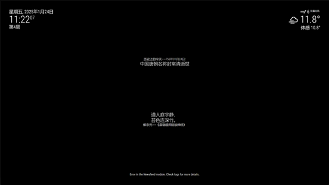

# MMM-ChinesePoetry

Magic Mirror模块，主要显示中文诗词。已有中文诗词插件[MMM-yijv](https://github.com/jdonge/MMM-yijv)的源[一句](http://yijuzhan.com/) 应该是挂了，我找了个新源[今日诗词](https://www.jinrishici.com)，在[MMM-yijv](https://github.com/jdonge/MMM-yijv)的基础上进行了修改，基本配置是一样的。

## 预览


## 安装
运行以下命令：

```shell
cd modules
git clone https://github.com/slacker-HD/MMM-ChinesePoetry.git
```
